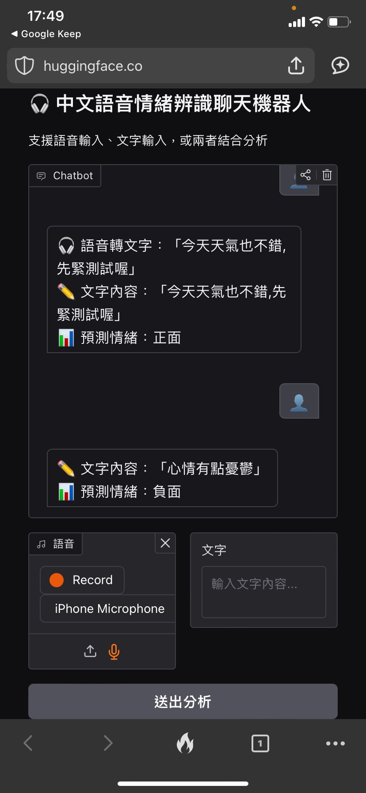

# 🎧 中文語音情緒辨識（EATD）

這是一個能夠辨識語音情緒（正面 / 中性 / 負面）的 Web App，採用：

- OpenAI Whisper 進行語音轉文字
- MFCC + delta 特徵萃取
- 多模態情緒辨識模型（只用 audio）


---

## 🌐 線上體驗

👉 [點我體驗 Demo（Hugging Face Spaces）](https://huggingface.co/spaces/pcreem/emo)



---

## ✨ 功能介紹

- 🎤 **語音輸入**：語音自動轉文字（Whisper），並以聲音特徵進行情緒分析。
- ✍️ **文字輸入**：直接輸入文字，透過中文 BERT 模型提取語意特徵。
- 🔀 **雙模態分析**：可同時輸入語音與文字，結合語音 + 文字特徵進行情緒分類。
- 💬 **聊天式介面**：Gradio 提供即時回應的 Chat UI，模仿 Telegram 機器人風格。

---

## 📦 安裝與執行

### 1. 安裝依賴套件

```bash
pip install -r requirements.txt
```

> 💡 請確認本機已安裝 `ffmpeg`（必要於 Whisper 運作）：
```bash
sudo apt install ffmpeg  # Linux
brew install ffmpeg      # macOS
```

### 2. 啟動 Web App

```bash
python app.py
```

啟動後會在本地開啟一個網址（例如 `http://127.0.0.1:7860`），使用瀏覽器即可操作。

---

## 🧠 使用技術與模型

| 模組           | 說明                                               |
|----------------|----------------------------------------------------|
| 🎙 Whisper      | 語音轉文字模型，支援中文語音辨識                   |
| 📊 Librosa     | 音訊特徵萃取（MFCC、Chroma、Mel）                   |
| 🔤 BERT         | 使用 HuggingFace 的 `bert-base-chinese` 提取語意   |
| 🤖 模型結構     | GRU + BiLSTM 架構，結合聲音與文字特徵進行分類       |
| 🎛 輸出情緒類別 | 正面 / 中性 / 負面（編號：0、1、2）                |

---

## 🗂 專案結構

```
.
├── app.py                  # 主程式入口，建立 Gradio Web UI
├── feature.py              # 模型架構與特徵萃取函式
├── model_weights.pth       # 訓練好的模型權重
├── requirements.txt        # 依賴套件
├── apt.txt                 # 系統依賴（部署用）
└── README.md               # 說明文件
```

---

## 🚀 部署建議

本專案已適配於：

- ✅ Hugging Face Spaces（需配合 `.gitattributes` 上傳模型權重）
- ✅ Render、Railway、Docker（只要有 Python 環境與 ffmpeg）

若部署到 Hugging Face，記得加入：

```bash
# .gitattributes
*.pth filter=lfs diff=lfs merge=lfs -text
```

並透過 `git lfs` 上傳模型檔案：

```bash
git lfs install
git lfs track "*.pth"
git add .gitattributes model_weights.pth
git commit -m "Add model weights"
git push
```

---

## 🙋‍♀️ 聯絡與貢獻

若您有任何問題或想要貢獻，歡迎開 issue 或發 PR！

---
